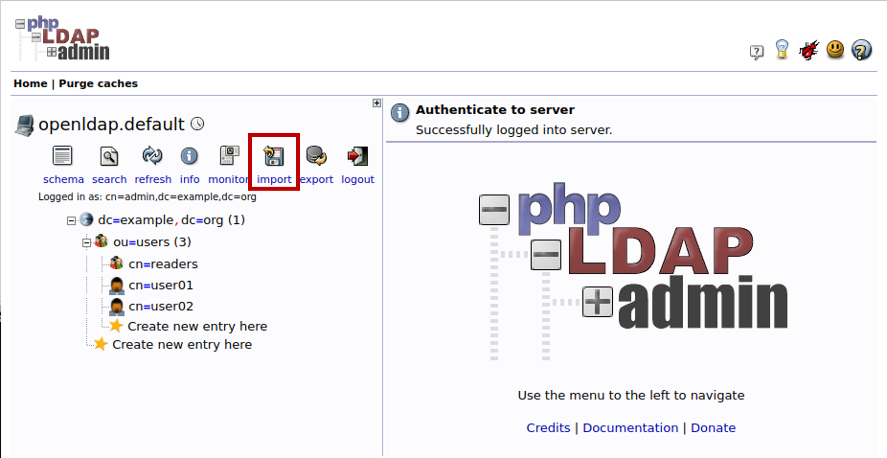

# OpenLDAP Templates

These templates help to configure the aerOS users/groups/roles in an OpenLDAP instance.

## How to use

### The first time OpenLDAP is configured
The first time OpenLDAP is configured, it is recommended to download all the Users/Groups/Roles files and import them into OpenLDAP. This will allow to create the basic OpenLDAP configuration with the users/groups/roles defined in aerOS. In case any of these are not to be used in the installation, simply do not import the file into the OpenLDAP GUI.

### To add a user/group/role
In case of adding a new user/group/role, it is recommended to download an example from this repository, make the necessary changes (naming and changing the unique identifier) and this file should be imported into OpenLDAP.

If a new user is created, once the file has been imported, the user can be assigned to groups and roles via the OpenLDAP GUI.

